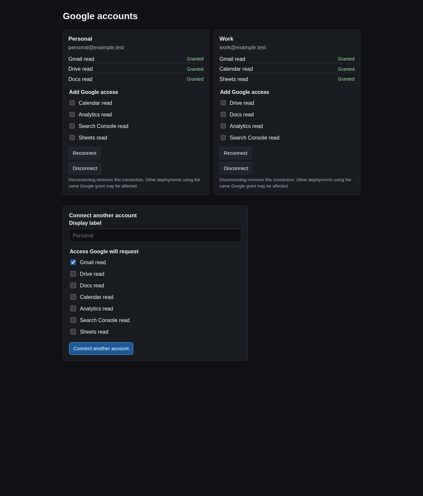
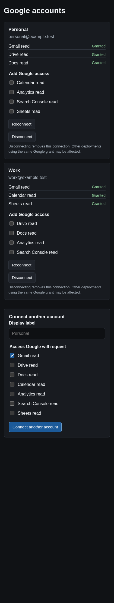

# gog-mcp — native Google MCP server

`gog-mcp` is a Go implementation of the Model Context Protocol that connects agents to Google Workspace APIs through native Google API clients. It runs over stdio by default and optionally serves stateless Streamable HTTP with authenticated callers. One server process can hold multiple Google accounts, and every call selects an account explicitly.



## What it exposes

- **`accounts_list`** — list Google connections granted to the caller with per-account capabilities.
- **Curated read operations** (default discovery): Gmail search and message/thread reads, Drive search and metadata, Google Docs text extraction, Calendar lists/events/free-busy, GA4 properties/metadata/reports, Search Console sites/queries, and Sheets metadata/range reads. All are `SafeRead`: retryable and bounded.
- **Compact discovery** (opt-in `--discovery=compact`): `capabilities_search`, `capabilities_describe`, and `capabilities_execute`, plus `accounts_list` when allowed and the caller has at least one grant, so the client discovers operations on demand instead of loading every tool.
- **Extended API catalog** (opt-in `--discovery=compact --api-catalog`): adds pinned Google discovery methods (1,108 methods across 29 services, executed as JSON REST with user OAuth scopes), bounded Business Profile account/location reads, bounded Gmail/Drive media operations, and authoring workflows for formatted mail, Docs, Slides, and Sheets.
- **Workflow resources**: five read-only recipe guides (`mail`, `documents`, `calendar`, `reporting`, `sheets`) served at `gog://workflows/v1/{slug}`. These are MCP resources, not native MCP Skills; they never activate automatically.
- **Temporary media resources**: Gmail attachments and Drive downloads/exports return account-bound artifact references served at `gog://media/{id}`. References expire after 15 minutes, are never enumerated, and never expose local files.

The extended catalog is breadth, not a parity promise: coverage follows the pinned discovery snapshot, media upload and download transports are excluded from catalog methods, and Business Profile access is the bounded account/location reads listed above.

## Safety model

- **Reads by default.** Write operations are disabled unless the server runs with `--enable-writes` and the caller holds an explicit write grant.
- **Explicit account selection.** Every Google operation takes `account_id` from `accounts_list`; nothing runs against an implicit default account.
- **Grants, not prompts.** Access is a startup snapshot of allow-listed operations plus account/client/action grants (and optional config policies). stdio reloads grants and policies on SIGHUP; HTTP mode treats its caller file as immutable until restart.
- **Non-replayable writes.** Write operations report `outcome_unknown` after ambiguous failures; callers must reconcile before repeating. Never blindly retry a write.
- **App-owned OAuth only.** Accounts are authorized through the app-owned OAuth client via the browser-based account connect page. Service account keys are not supported.
- **Bounded calls.** Each tool request carries a Google API attempt budget (1–256, default 32, including retries), a per-tool deadline (default 30s), a server-wide concurrency limit (default 32), and an 8 MiB body bound. Inline media delivery is capped (1 MiB default, 2 MiB maximum); larger transfers stay out of scope.

## Build

```sh
make            # or: make build
./bin/gog-mcp --version
```

`make fmt`, `make lint`, `make test`, and `make ci` cover formatting, linting, tests, and the full local gate; `make tools` installs the pinned dev tools into `.tools/`. The Go module remains `github.com/steipete/gogcli` for compatibility with existing state paths and imports; the executable is `gog-mcp`.

## Run (stdio)

stdio is the default transport: MCP frames on stdout, logs on stderr.

```sh
# Read-only, curated operations only
./bin/gog-mcp \
  --allow-operations accounts_list,gmail_search,gmail_get_thread,drive_search,calendar_list_events

# Grants file with per-account/client/action grants, writes enabled server-side
./bin/gog-mcp --grants-file grants.json --enable-writes
```

A grants file looks like:

```json
{
  "principal_id": "local",
  "allow_operations": ["accounts_list", "gmail_search", "drive_search"],
  "grants": [
    {
      "principal_id": "local",
      "account_ids": ["ACCOUNT_ID"],
      "client_names": ["native-mcp"],
      "operations": ["gmail_search", "drive_search"]
    }
  ]
}
```

An empty grants list grants no Google access. `--api-catalog` makes additional capabilities discoverable; it grants no access by itself.

## Account onboarding

The account connect page is a loopback HTTP server the app itself serves:

```sh
./bin/gog-mcp --connect-addr 127.0.0.1:8787 \
  --allow-operations accounts_list,gmail_search
```

Open the printed URL, sign in with Google, and consent. Default consent is Gmail read access; pass `--connect-scopes` to offer additional scopes explicitly. The page supports connect, reconnect, disconnect, and status flows, and uses the app-owned OAuth client bucket (`--client-name`, default `native-mcp`). The callback URL defaults to `http://<connect-addr>/oauth/callback`; register the exact URL on the OAuth client or set `--redirect-url`. The connect address must be loopback.



OAuth client credentials, tokens (OS keyring or encrypted keyring file), and the account registry (`mcp-accounts.json` under the gogcli config dir by default, overridable with `--registry-file`) are provisioned outside Git. For the deployed server, follow [deploy/google-mcp/README.md](deploy/google-mcp/README.md); it owns bootstrap, secret mounting, and rollout.

## Streamable HTTP (optional)

```sh
./bin/gog-mcp --http-addr 0.0.0.0:8080 --http-config http-config.json
```

The HTTP config is a trusted caller file: an exact `Host`, optional exact `allowed_origins`, and up to 32 callers, each with an ID, a SHA-256 digest of its bearer token, a principal ID, and its own operations/grants. Distinct harnesses sharing a principal share that owner's accounts and limits; distinct owners need distinct principals. The MCP endpoint is `/mcp`, authentication is by bearer token (never by forwarded identity headers), and the server stores only token digests. See [deploy/google-mcp/README.md](deploy/google-mcp/README.md) for the full deployment setup and the example caller file.

## Flags

| Flag | Env | Default | Meaning |
| --- | --- | --- | --- |
| `--principal` | `GOG_MCP_PRINCIPAL` | `local` | Trusted caller principal ID (stdio) |
| `--allow-operations` | `GOG_MCP_ALLOW_OPERATIONS` | — | Comma-separated enabled operations (stdio) |
| `--grants-file` | `GOG_MCP_GRANTS_FILE` | — | JSON caller/account/client/action grants (stdio) |
| `--http-addr` | `GOG_MCP_HTTP_ADDR` | — | Streamable HTTP listen address; empty keeps stdio |
| `--http-config` | `GOG_MCP_HTTP_CONFIG` | — | Caller/token/grant JSON file, required with `--http-addr` |
| `--registry-file` | `GOG_MCP_REGISTRY_FILE` | `<config>/mcp-accounts.json` | Persistent account registry path |
| `--client-name` | `GOG_MCP_CLIENT_NAME` | `native-mcp` | App-owned OAuth credential bucket |
| `--connect-addr` | `GOG_MCP_CONNECT_ADDR` | — | Loopback address for the account connect page |
| `--redirect-url` | `GOG_MCP_REDIRECT_URL` | derived from connect addr | Exact registered OAuth callback URL |
| `--connect-scopes` | `GOG_MCP_CONNECT_SCOPES` | — | Additional OAuth scopes offered on the connect page |
| `--request-timeout` | `GOG_MCP_REQUEST_TIMEOUT` | `30s` | Per-tool deadline |
| `--max-concurrency` | `GOG_MCP_MAX_CONCURRENCY` | `32` | In-flight tool calls |
| `--discovery` | `GOG_MCP_DISCOVERY` | `expanded` | `expanded` curated tools or `compact` capability search |
| `--api-catalog` | `GOG_MCP_API_CATALOG` | off | Extended API catalog + workflows; requires `--discovery=compact` |
| `--enable-writes` | `GOG_MCP_ENABLE_WRITES` | off | Permit explicitly granted write operations |
| `--max-upstream-calls` | `GOG_MCP_MAX_UPSTREAM_CALLS` | `32` | Google API attempts per request, including retries (1–256) |
| `--version` | — | — | Print version and exit |

Tool names are the stable contract; curated reads, gateways, workflows, and catalog methods are all resolved against the same grant model described in [docs/spec.md](docs/spec.md).

## Documentation

- [docs/spec.md](docs/spec.md) — architecture, tool catalog, transports, limits, and error contract.
- [deploy/google-mcp/README.md](deploy/google-mcp/README.md) — container deployment, secrets layout, onboarding, and rollout.
- [CONTEXT.md](CONTEXT.md) — domain vocabulary used in issues and code.
- [docs/agents/](docs/agents/) — issue tracker, triage labels, and domain-doc conventions for agents.

## Development

Tests use stdlib `testing` and `httptest`, next to the code they cover. Run `make ci` for the local gate. Container transport and authentication checks are documented in [deploy/google-mcp/README.md](deploy/google-mcp/README.md). These checks do not establish live Google API behavior.

## License

MIT. This project originates from Peter Steinberger's [`gogcli`](https://github.com/steipete/gogcli), which itself drew on Mario Zechner's `gmcli`/`gccli`/`gdcli`; attribution is retained under the MIT license. The repository lives at [Robben-Media/gogcli](https://github.com/Robben-Media/gogcli).
